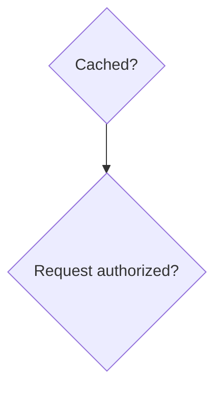
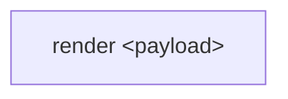
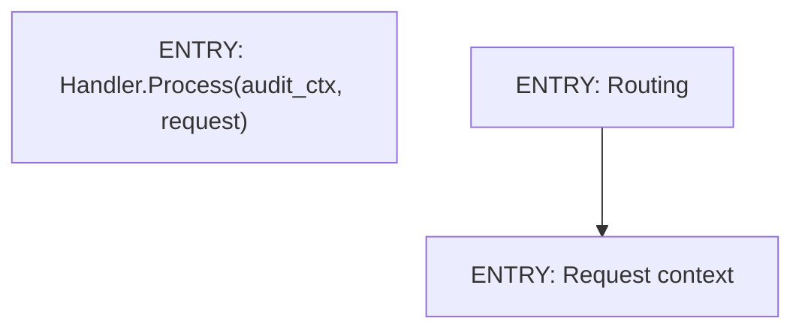
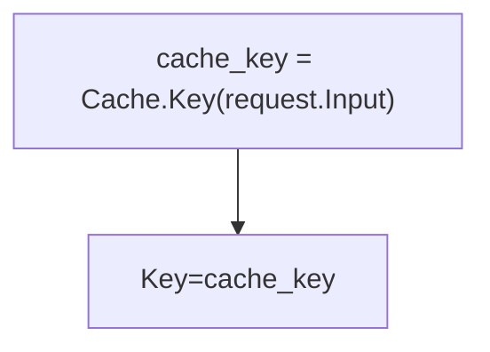
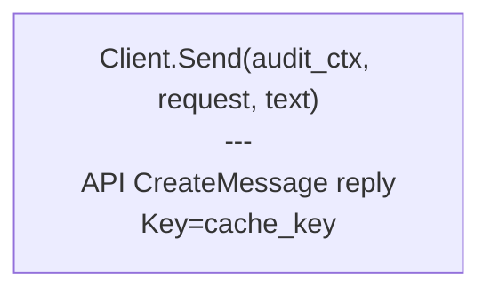
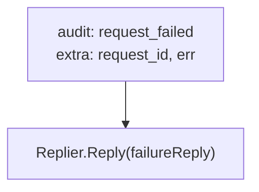
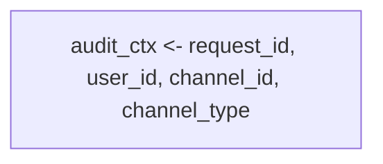
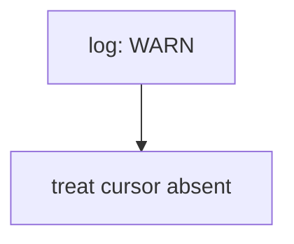

# Chart conventions

These rules do not apply to planning documents such as `ROADMAP.md` (see
[`doc-quality.md`](doc-quality.md#planning-documents)).

## Format

Markdown charts use Mermaid.

Charts describe ordered behavior: operations, decisions, state mutation points, audit/log emissions, and handoffs.
Static contracts, full payload shapes, stable field catalogs, option matrices, and API surfaces belong in tables or
prose unless a value's availability changes during the sequence.

Large flows are split into phase-level charts with stable handoff labels. Each chart covers one coherent phase.

Mermaid flowcharts use `flowchart TD` unless the subject is inherently horizontal.

Line breaks inside node labels use ` ` only to separate distinct operations or effects (e.g., a call line from
its `---` effect line). **Do not insert ` ` inside a comma-separated list** — let Mermaid wrap the rendered
output. A manual break inside a list is a chart-quality defect even when the rendered result looks identical.

Node labels are quoted. Labels in specs routinely contain punctuation, spaces, method calls, braces, angle brackets,
or emoji names, and quoted labels avoid Mermaid parser ambiguity.

Node IDs use short readable uppercase ASCII names:

Terminal outcomes use semantic labels such as `drop`, `return nil`, or `tool result success`. Pass-through `END`
nodes are omitted. When an anonymous terminal sink is still needed, its node ID is `END`; Mermaid's special parsing of
lowercase `end` and edge targets beginning with `o` or `x` is avoided.

Each edge has its own line.

Literal markup-like data in labels uses HTML entities when the markup itself is part of a temporal step:

## Prose

Chart introductions describe present-state behavior: the path covered, the state entering the chart, and the state
handed off.

## Entry points

Ownership-boundary calls and chart-to-chart handoffs use `ENTRY:`:

The terminal handoff label in the source chart matches the entry label in the target chart exactly.

Helper calls inside the current owner use assignment or plain call syntax.

Rectangular nodes carry calls, assignments, audit events, logs, and effects. Diamond nodes carry decisions. Other
Mermaid shapes require domain meaning in the surrounding documentation.

## Calls and effects

Helper calls that produce values use assignment form, and assigned values are reused downstream:

Nodes that combine a method call with an externally visible effect put the method call first, followed by the separator
line `---`, followed by the effect and the few values whose timing matters:

The method call line has no category prefix. Effects use surface or backend prefixes.

Each node contains one operation at the current abstraction level. Separate calls, audit events, user-visible replies,
state writes, and terminal states use separate nodes. The separator line `---` describes the effect of the operation
above it; it is not used to bundle a second operation into the same node.

Node labels name real symbols — method calls, audit events, configured constants, ENTRY handoff targets, or
self-describing operations like `send emptyReply`. Don't invent function-like primitives such as
`terminal_reply(kind, text)` that don't appear in code; a future reader can't grep for them.

## Audit and logs

Audit-event nodes use `audit:` and event-specific values use `extra:`:

Audit and log nodes contain only the emitted event and its event-specific values. Follow-up control flow,
user-visible replies, recovery steps, and terminal states use separate nodes.

Audit-context writes use `audit_ctx <-`:

When the value comes from external state, name the source: `audit_ctx <- user_name from profile service`.
Don't use vague qualifiers like `when found`.

Runtime warning nodes use `log: WARN`:

Other structured-emission channels mirror this audit-node convention, carrying the channel's own prefix in place of
`audit:` and `extra:` for event-specific values.

## Branch labels

A fallible operation with an explicit `fail` edge uses a matching `ok` edge for the success continuation. Decision
nodes use domain labels.

Branch outcomes are edge labels, not destination-node names.

## Mermaid features

Subgraphs are used only when the nested boundary is part of the documented behavior.

Interactive Mermaid features are omitted from specification charts.

Custom styling is omitted unless styling carries a semantic distinction.

Mermaid comments (`%%`) are reserved for syntax-facing notes. Specification content lives in prose or rendered labels.
